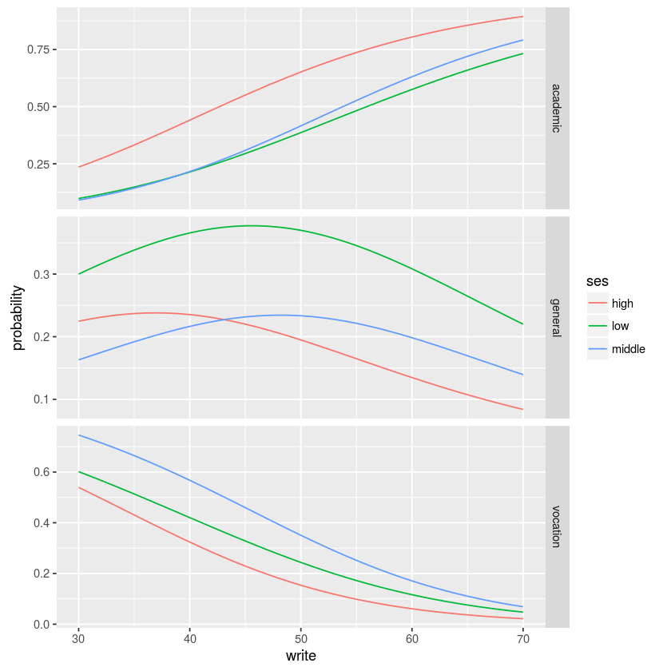

What is Multinomial Regression ?

Multinomial Logistic Regression (MLR) is a form of linear regression analysis conducted when the dependent variable is nominal with more than two levels. It is used to describe data and to explain the relationship between one dependent nominal variable and one or more continuous-level (interval or ratio scale) independent variables. You can understand nominal variable as, a variable which has no intrinsic ordering.

For example: Types of Forests: ‘Evergreen Forest’, ‘Deciduous Forest’, ‘Rain Forest’. As you see, there is no intrinsic order in them, but each forest represent a unique category. In other words, multinomial regression is an extension of logistic regression, which analyzes dichotomous (binary) dependents.


```R
install.packages(c("nnet","sandwich","msm","reshape2"))

library(foreign)
library(ggplot2)
library(MASS)
library(Hmisc)
library(reshape2)
library(sandwich)
library(msm)


```

    Installing packages into '/home/nbcommon/R'
    (as 'lib' is unspecified)
    Loading required package: lattice
    Loading required package: survival
    Loading required package: Formula
    
    Attaching package: 'Hmisc'
    
    The following objects are masked from 'package:base':
    
        format.pval, round.POSIXt, trunc.POSIXt, units
    


```R
library(nnet)
library(ggplot2)
library(reshape2)

ml <- read.csv("https://raw.githubusercontent.com/RWorkshop/workshopdatasets/master/multilog.csv")
```


```R
with(ml, table(ses, prog))
 

```


            prog
    ses      academic general vocation
      high         42       9        7
      low          19      16       12
      middle       44      20       31


```R
with(ml, do.call(rbind, tapply(write, prog, function(x) c(M = mean(x), SD = sd(x)))))

```


<table>
<thead><tr><th></th><th>M</th><th>SD</th></tr></thead>
<tbody>
	<tr><th>academic</th><td>56.25714</td><td>7.943343</td></tr>
	<tr><th>general</th><td>51.33333</td><td>9.397775</td></tr>
	<tr><th>vocation</th><td>46.76000</td><td>9.318754</td></tr>
</tbody>
</table>


```R
ml$prog2 <- relevel(ml$prog, ref = "academic")
test <- multinom(prog2 ~ ses + write, data = ml)

```

    # weights:  15 (8 variable)
    initial  value 219.722458 
    iter  10 value 179.983731
    final  value 179.981726 
    converged


```R
summary(test)
```


    Call:
    multinom(formula = prog2 ~ ses + write, data = ml)
    
    Coefficients:
             (Intercept)    seslow sesmiddle       write
    general     1.689478 1.1628411 0.6295638 -0.05793086
    vocation    4.235574 0.9827182 1.2740985 -0.11360389
    
    Std. Errors:
             (Intercept)    seslow sesmiddle      write
    general     1.226939 0.5142211 0.4650289 0.02141101
    vocation    1.204690 0.5955688 0.5111119 0.02222000
    
    Residual Deviance: 359.9635 
    AIC: 375.9635 


```R
### Test Statistics and P-values
z <- summary(test)$coefficients/summary(test)$standard.errors
z

p <- (1 - pnorm(abs(z), 0, 1)) * 2
p

```


<table>
<thead><tr><th></th><th>(Intercept)</th><th>seslow</th><th>sesmiddle</th><th>write</th></tr></thead>
<tbody>
	<tr><th>general</th><td>1.376987 </td><td>2.261364 </td><td>1.353816 </td><td>-2.705658</td></tr>
	<tr><th>vocation</th><td>3.515904 </td><td>1.650050 </td><td>2.492798 </td><td>-5.112687</td></tr>
</tbody>
</table>


<table>
<thead><tr><th></th><th>(Intercept)</th><th>seslow</th><th>sesmiddle</th><th>write</th></tr></thead>
<tbody>
	<tr><th>general</th><td>0.1685163893</td><td>0.02373673  </td><td>0.1757949   </td><td>6.816914e-03</td></tr>
	<tr><th>vocation</th><td>0.0004382601</td><td>0.09893276  </td><td>0.0126741   </td><td>3.176088e-07</td></tr>
</tbody>
</table>


### Interpretation

1. Model execution output shows some iteration history and includes the final negative log-likelihood 179.981726. This value is multiplied by two as shown in the model summary as the Residual Deviance.

2. The summary output has a block of coefficients and another block of standard errors. Each blocks has one row of values corresponding to one model equation. In the block of coefficients, we see that the first row is being compared to prog = “general” to our baseline prog = “academic” and the second row to prog = “vocation” to our baseline prog = “academic”.

3. A one-unit increase in write decreases the log odds of being in general program vs. academic program by 0.0579

4. A one-unit increase in write decreases the log odds of being in vocation program vs. academic program by 0.1136

5. The log odds of being in general program than in academic program will decrease by 1.163 if moving from ses=”low” to ses=”high”.

6. On the other hand, Log odds of being in general program than in academic program will decrease by 0.5332 if moving from ``ses="low"`` to ses=”middle”

7. The log odds of being in vocation program vs. in academic program will decrease by 0.983 if moving from ``ses="low"`` to ``ses=”high”``

8. The log odds of being in vocation program vs. in academic program will increase by 0.291 if moving from ``ses="low"`` to ``ses="middle"``

Now we’ll calculate Z score and p-Value for the variables in the model.


```R
## extract the coefficients from the model and exponentiate
exp(coef(test))

head(pp <- fitted(test))
```


<table>
<thead><tr><th></th><th>(Intercept)</th><th>seslow</th><th>sesmiddle</th><th>write</th></tr></thead>
<tbody>
	<tr><th>general</th><td> 5.416653</td><td>3.199009 </td><td>1.876792 </td><td>0.9437152</td></tr>
	<tr><th>vocation</th><td>69.101326</td><td>2.671709 </td><td>3.575477 </td><td>0.8926115</td></tr>
</tbody>
</table>


<table>
<thead><tr><th></th><th>academic</th><th>general</th><th>vocation</th></tr></thead>
<tbody>
	<tr><th>1</th><td>0.1482721</td><td>0.3382509</td><td>0.5134769</td></tr>
	<tr><th>2</th><td>0.1201988</td><td>0.1806335</td><td>0.6991678</td></tr>
	<tr><th>3</th><td>0.4186768</td><td>0.2368137</td><td>0.3445095</td></tr>
	<tr><th>4</th><td>0.1726839</td><td>0.3508433</td><td>0.4764728</td></tr>
	<tr><th>5</th><td>0.1001206</td><td>0.1689428</td><td>0.7309367</td></tr>
	<tr><th>6</th><td>0.3533583</td><td>0.2378047</td><td>0.4088370</td></tr>
</tbody>
</table>


```R
dses <- data.frame(ses = c("low", "middle", "high"), write = mean(ml$write))

predict(test, newdata = dses, "probs")

```


<table>
<thead><tr><th></th><th>academic</th><th>general</th><th>vocation</th></tr></thead>
<tbody>
	<tr><th>1</th><td>0.4396813</td><td>0.3581915</td><td>0.2021272</td></tr>
	<tr><th>2</th><td>0.4777451</td><td>0.2283359</td><td>0.2939190</td></tr>
	<tr><th>3</th><td>0.7009046</td><td>0.1784928</td><td>0.1206026</td></tr>
</tbody>
</table>


```R
dwrite <- data.frame(ses = rep(c("low", "middle", "high"), each = 41), write = rep(c(30:70),
    3))

## store the predicted probabilities for each value of ses and write
pp.write <- cbind(dwrite, predict(test, newdata = dwrite, type = "probs", se = TRUE))

## calculate the mean probabilities within each level of ses
by(pp.write[, 3:5], pp.write$ses, colMeans)
```


    pp.write$ses: high
     academic   general  vocation 
    0.6164348 0.1808049 0.2027603 
    ------------------------------------------------------------ 
    pp.write$ses: low
     academic   general  vocation 
    0.3972955 0.3278180 0.2748864 
    ------------------------------------------------------------ 
    pp.write$ses: middle
     academic   general  vocation 
    0.4256172 0.2010877 0.3732951 


```R

## melt data set to long for ggplot2
lpp <- melt(pp.write, id.vars = c("ses", "write"), value.name = "probability")
head(lpp)  # view first few rows

## plot predicted probabilities across write values for each level of ses
## facetted by program type
ggplot(lpp, aes(x = write, y = probability, colour = ses)) + geom_line() + facet_grid(variable ~
    ., scales = "free")
```


<table>
<thead><tr><th>ses</th><th>write</th><th>variable</th><th>probability</th></tr></thead>
<tbody>
	<tr><td>low       </td><td>30        </td><td>academic  </td><td>0.09843258</td></tr>
	<tr><td>low       </td><td>31        </td><td>academic  </td><td>0.10716517</td></tr>
	<tr><td>low       </td><td>32        </td><td>academic  </td><td>0.11650018</td></tr>
	<tr><td>low       </td><td>33        </td><td>academic  </td><td>0.12645441</td></tr>
	<tr><td>low       </td><td>34        </td><td>academic  </td><td>0.13704163</td></tr>
	<tr><td>low       </td><td>35        </td><td>academic  </td><td>0.14827211</td></tr>
</tbody>
</table>





```R
## melt data set to long for ggplot2
lpp <- melt(pp.write, id.vars = c("ses", "write"), value.name = "probability")
head(lpp)  # view first few rows
 
##   ses write variable probability
## 1 low    30 academic     0.09844
## 2 low    31 academic     0.10717
## 3 low    32 academic     0.11650
## 4 low    33 academic     0.12646
## 5 low    34 academic     0.13705
## 6 low    35 academic     0.14828
 


## plot predicted probabilities across write values for each level of ses
## facetted by program type
ggplot(lpp, aes(x = write, y = probability, colour = ses)) + geom_line() + facet_grid(variable ~
    ., scales = "free")
```
